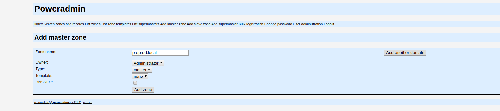
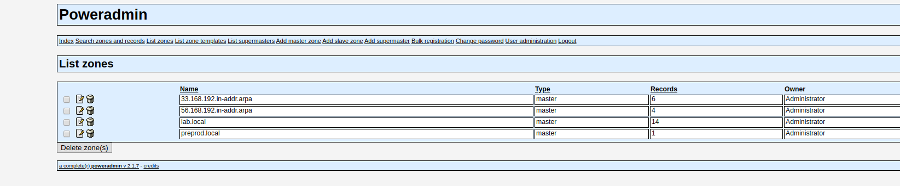

# TP dns
## Questions
### 1.
```
vagrant@proxy:~$ cat /etc/resolv.conf 
domain auvence.co
search auvence.co
nameserver 192.168.33.21
nameserver 192.168.33.22
nameserver 10.0.2.3
```
### 2.
```
vagrant@wiki:~$ dig wiki.lab.local

; <<>> DiG 9.10.3-P4-Debian <<>> wiki.lab.local
;; global options: +cmd
;; Got answer:
;; ->>HEADER<<- opcode: QUERY, status: NOERROR, id: 40668
;; flags: qr rd ra; QUERY: 1, ANSWER: 1, AUTHORITY: 0, ADDITIONAL: 1

;; OPT PSEUDOSECTION:
; EDNS: version: 0, flags:; udp: 4096
;; QUESTION SECTION:
;wiki.lab.local.			IN	A

;; ANSWER SECTION:
wiki.lab.local.		3600	IN	A	192.168.56.11

;; Query time: 5 msec
;; SERVER: 192.168.33.22#53(192.168.33.22)
;; WHEN: Fri Oct 18 10:12:09 GMT 2019
;; MSG SIZE  rcvd: 59
```
### 3.
```
[vagrant@auth-1 ~]$ sudo ss -laputn
Netid State      Recv-Q Send-Q            Local Address:Port                           Peer Address:Port              
udp   UNCONN     0      0                             *:11713                                     *:*                   users:(("pdns_server",pid=6259,fd=18))
udp   UNCONN     0      0                             *:973                                       *:*                   users:(("rpcbind",pid=1287,fd=10))
udp   UNCONN     0      0                             *:53                                        *:*                   users:(("pdns_server",pid=6259,fd=5))
udp   UNCONN     0      0                     127.0.0.1:323                                       *:*                   users:(("chronyd",pid=1385,fd=1))
udp   UNCONN     0      0                             *:68                                        *:*                   users:(("dhclient",pid=6295,fd=6))
udp   UNCONN     0      0                             *:111                                       *:*                   users:(("rpcbind",pid=1287,fd=5),("systemd",pid=1,fd=58))
udp   UNCONN     0      0                            :::973                                      :::*                   users:(("rpcbind",pid=1287,fd=11))
udp   UNCONN     0      0                            :::53                                       :::*                   users:(("pdns_server",pid=6259,fd=6))
udp   UNCONN     0      0                           ::1:323                                      :::*                   users:(("chronyd",pid=1385,fd=2))
udp   UNCONN     0      0                            :::111                                      :::*                   users:(("rpcbind",pid=1287,fd=7),("systemd",pid=1,fd=60))
udp   UNCONN     0      0                            :::18326                                    :::*                   users:(("pdns_server",pid=6259,fd=19))
tcp   LISTEN     0      50                    127.0.0.1:3306                                      *:*                   users:(("mysqld",pid=6187,fd=14))
tcp   LISTEN     0      128                           *:111                                       *:*                   users:(("rpcbind",pid=1287,fd=4),("systemd",pid=1,fd=57))
tcp   LISTEN     0      128               192.168.33.31:80                                        *:*                   users:(("httpd",pid=6244,fd=3),("httpd",pid=6243,fd=3),("httpd",pid=6242,fd=3),("httpd",pid=6241,fd=3),("httpd",pid=6240,fd=3),("httpd",pid=6238,fd=3))
tcp   LISTEN     0      128                           *:53                                        *:*                   users:(("pdns_server",pid=6259,fd=7))
tcp   LISTEN     0      128                           *:22                                        *:*                   users:(("sshd",pid=2373,fd=3))
tcp   LISTEN     0      100                   127.0.0.1:25                                        *:*                   users:(("master",pid=2617,fd=13))
tcp   ESTAB      0      0                     10.0.2.15:22                                 10.0.2.2:44844               users:(("sshd",pid=28415,fd=3),("sshd",pid=28412,fd=3))
tcp   ESTAB      0      0                     127.0.0.1:47712                             127.0.0.1:3306                users:(("pdns_server",pid=6259,fd=22))
tcp   ESTAB      0      0                     127.0.0.1:47704                             127.0.0.1:3306                users:(("pdns_server",pid=6259,fd=10))
tcp   ESTAB      0      0                     127.0.0.1:3306                              127.0.0.1:47708               users:(("mysqld",pid=6187,fd=38))
tcp   ESTAB      0      0                     127.0.0.1:3306                              127.0.0.1:47704               users:(("mysqld",pid=6187,fd=34))
tcp   ESTAB      0      0                     127.0.0.1:3306                              127.0.0.1:47712               users:(("mysqld",pid=6187,fd=40))
tcp   ESTAB      0      0                     127.0.0.1:3306                              127.0.0.1:47710               users:(("mysqld",pid=6187,fd=39))
tcp   ESTAB      0      0                     127.0.0.1:47706                             127.0.0.1:3306                users:(("pdns_server",pid=6259,fd=11))
tcp   ESTAB      0      0                     127.0.0.1:3306                              127.0.0.1:47706               users:(("mysqld",pid=6187,fd=37))
tcp   ESTAB      0      0                     127.0.0.1:47710                             127.0.0.1:3306                users:(("pdns_server",pid=6259,fd=21))
tcp   ESTAB      0      0                     127.0.0.1:47708                             127.0.0.1:3306                users:(("pdns_server",pid=6259,fd=20))
tcp   LISTEN     0      128                          :::111                                      :::*                   users:(("rpcbind",pid=1287,fd=6),("systemd",pid=1,fd=59))
tcp   LISTEN     0      128                          :::53                                       :::*                   users:(("pdns_server",pid=6259,fd=8))
tcp   LISTEN     0      128                          :::22                                       :::*                   users:(("sshd",pid=2373,fd=4))
tcp   LISTEN     0      100                         ::1:25                                       :::*                   users:(("master",pid=2617,fd=14))
```
Pour le service pdns (PowerDNS) il est configurer dans /etc/pdns/ dans le fichier:
```
/etc/pdns/pdns.conf
```
Pour le service mysql il est configurer dans le fichier:
```
/etc/my.cnf
```
### 4.
```
[vagrant@recursor-1 ~]$ sudo ss -laputn
Netid State      Recv-Q Send-Q                                                                        Local Address:Port                                                                                       Peer Address:Port              
udp   UNCONN     0      0                                                                                         *:969                                                                                                   *:*                   users:(("rpcbind",pid=1239,fd=10))
udp   UNCONN     0      0                                                                             192.168.33.21:53                                                                                                    *:*                   users:(("pdns_recursor",pid=5870,fd=5))
udp   UNCONN     0      0                                                                                 127.0.0.1:53                                                                                                    *:*                   users:(("pdns_recursor",pid=5870,fd=4))
udp   UNCONN     0      0                                                                                 127.0.0.1:323                                                                                                   *:*                   users:(("chronyd",pid=1351,fd=1))
udp   UNCONN     0      0                                                                                         *:68                                                                                                    *:*                   users:(("dhclient",pid=5873,fd=6))
udp   UNCONN     0      0                                                                                         *:68                                                                                                    *:*                   users:(("dhclient",pid=2736,fd=6))
udp   UNCONN     0      0                                                                                         *:111                                                                                                   *:*                   users:(("rpcbind",pid=1239,fd=5),("systemd",pid=1,fd=74))
udp   UNCONN     0      0                                                                                        :::969                                                                                                  :::*                   users:(("rpcbind",pid=1239,fd=11))
udp   UNCONN     0      0                                                                                       ::1:323                                                                                                  :::*                   users:(("chronyd",pid=1351,fd=2))
udp   UNCONN     0      0                                                                                        :::111                                                                                                  :::*                   users:(("rpcbind",pid=1239,fd=7),("systemd",pid=1,fd=76))
tcp   LISTEN     0      128                                                                                       *:111                                                                                                   *:*                   users:(("rpcbind",pid=1239,fd=4),("systemd",pid=1,fd=73))
tcp   LISTEN     0      128                                                                           192.168.33.21:53                                                                                                    *:*                   users:(("pdns_recursor",pid=5870,fd=7))
tcp   LISTEN     0      128                                                                               127.0.0.1:53                                                                                                    *:*                   users:(("pdns_recursor",pid=5870,fd=6))
tcp   LISTEN     0      128                                                                                       *:22                                                                                                    *:*                   users:(("sshd",pid=2379,fd=3))
tcp   LISTEN     0      100                                                                               127.0.0.1:25                                                                                                    *:*                   users:(("master",pid=2622,fd=13))
tcp   ESTAB      0      0                                                                                 10.0.2.15:22                                                                                             10.0.2.2:52494               users:(("sshd",pid=6059,fd=3),("sshd",pid=6056,fd=3))
tcp   LISTEN     0      128                                                                                      :::111                                                                                                  :::*                   users:(("rpcbind",pid=1239,fd=6),("systemd",pid=1,fd=75))
tcp   LISTEN     0      128                                                                                      :::22                                                                                                   :::*                   users:(("sshd",pid=2379,fd=4))
tcp   LISTEN     0      100                                                                                     ::1:25                                                                                                   :::*                   users:(("master",pid=2622,fd=14))
```
Pour le service pdns (PowerDNS) il est configurer dans /etc/pdns-recursor/, dans le fichier
```
/etc/pdns-recursor/recursor.conf
```
### 5.
```
[vagrant@recursor-1 ~]$ cat /etc/pdns-recursor/recursor.conf | grep lab.local
forward-zones=lab.local=192.168.56.31;192.168.56.32
```
Pour le domaine lab.local les serveurs recursif vont transmettre les nom de zone aux IP's suivante: 
```
192.168.56.31 
192.168.56.32
```
Qui sont celle des serveurs authoritatif
### 6.
On peut le mettre en évidence en regardant dans le fichier de conf
```
[vagrant@recursor-1 ~]$ cat /etc/pdns-recursor/recursor.conf | grep 192.168.33
allow-from=127.0.0.0/8, 192.168.33.0/24
local-address=127.0.0.1,192.168.33.21
```
En cherchant l'adresse de réseau dans le fichier de configuration on vois qu'il autorise le pdns a communiquer sur le réseau 192.168.33.0/24 

### 7.
Le service mysql est sécurisé car il n'écoute que sur la boucle local `127.0.0.1`.
## Actions
### 1.
J'accede a l'interface graphique de chacun des deux serveurs authoritatif avec leurs adresses respective sur le réseau `192.168.33.0/24`
```
192.168.33.31/poweradmin/
192.168.33.32/poweradmin/
```
Je clique sur `Add master zone`

DNSSEC est une option pour palier a certain problème de sécurité lié au protocole DNS

On peut voir que j'ai rajouter le domaine preprod.local. Je vais repeter l'opération sur le second serveur authoritatif
